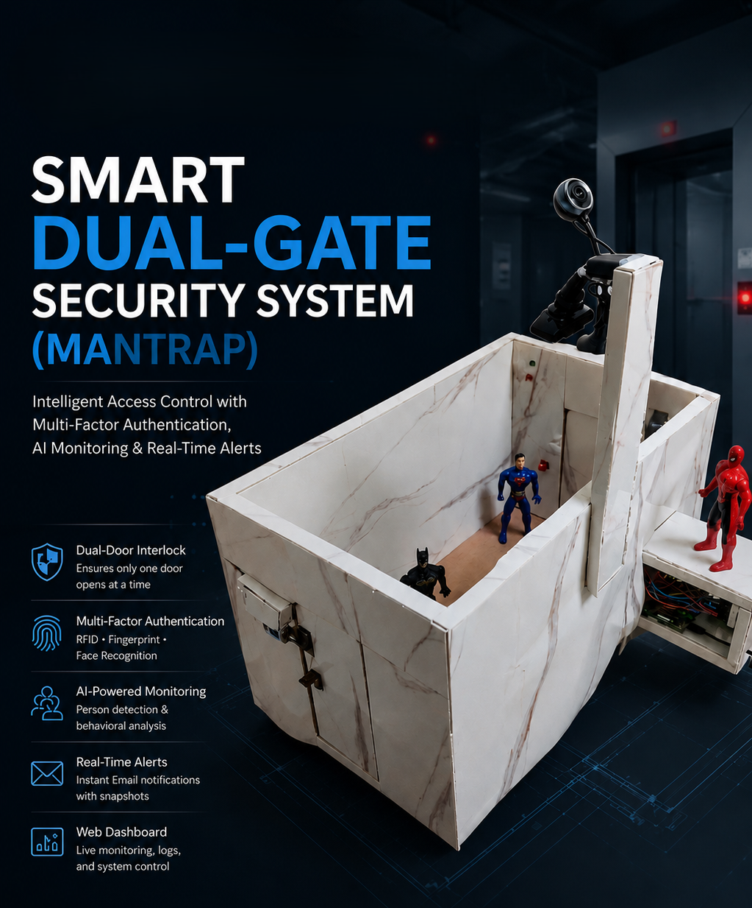
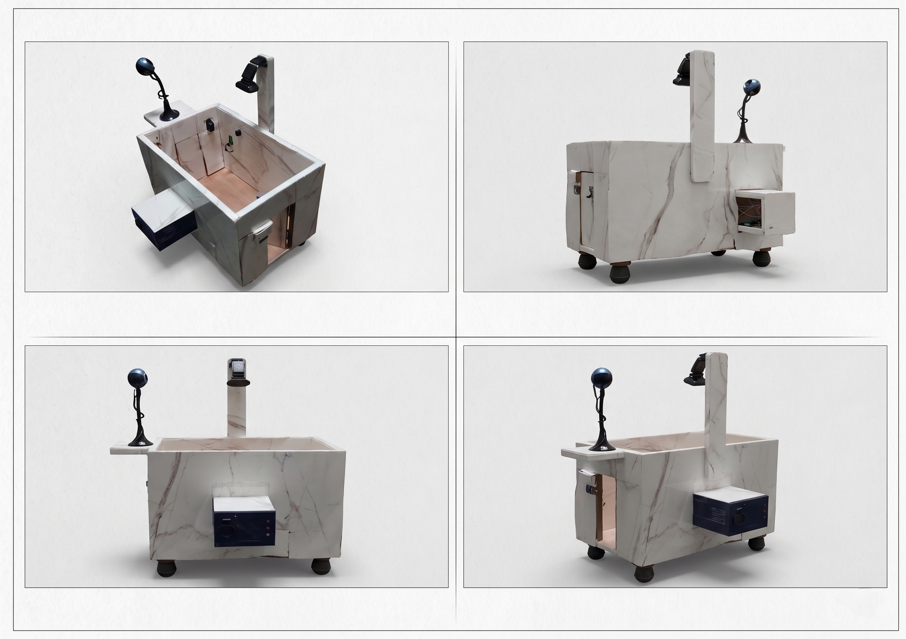
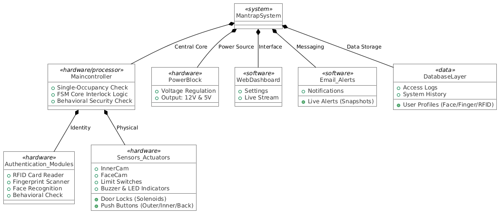
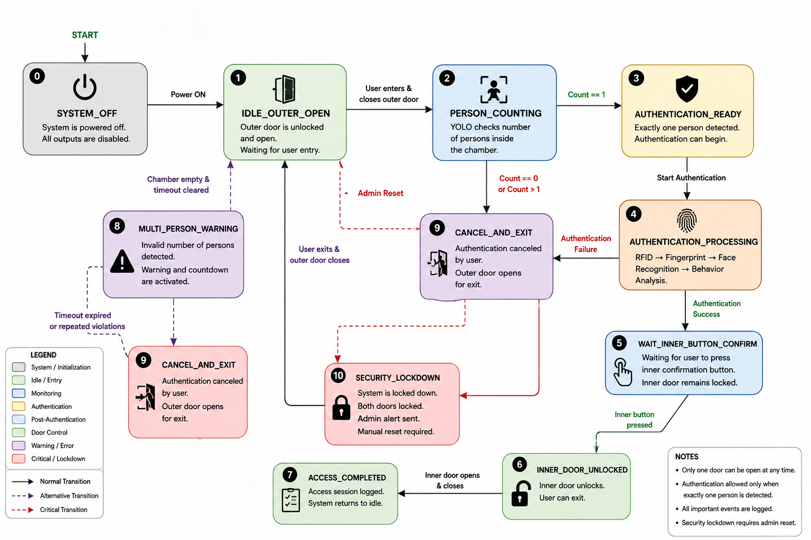
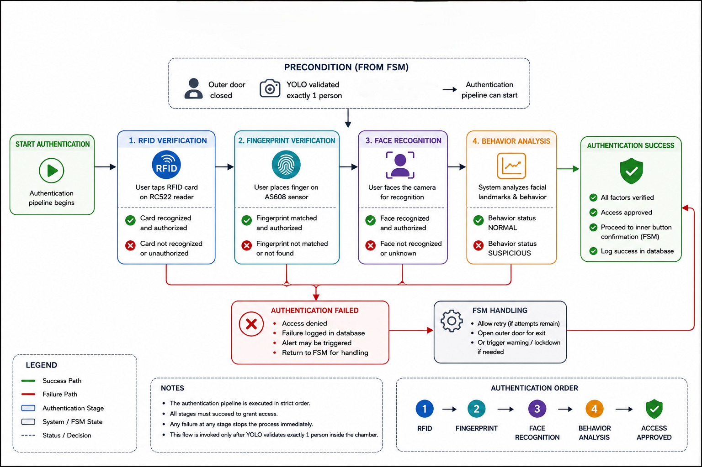
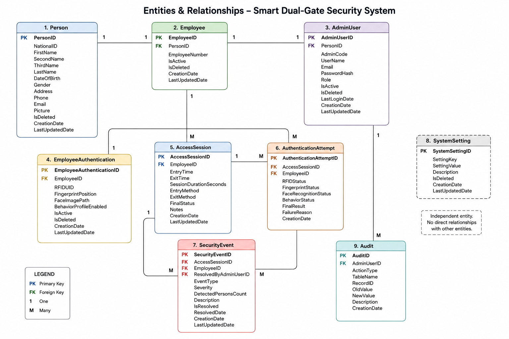

# Smart Dual-Gate Security System

<p align="center">
  
</p>

<p align="center">
  <b>AI-Powered Multi-Factor Physical Security Platform</b>
</p>

<p align="center">
  Raspberry Pi 4 • YOLOv8 • RFID • Fingerprint • Face Recognition • SQLite • Flask
</p>

---

## Overview

The Smart Dual-Gate Security System is a real-time intelligent physical security platform built around a dual-door mantrap architecture.

The project combines embedded systems, computer vision, artificial intelligence, multi-factor authentication, database engineering, and security workflow automation into a single integrated solution.

Unlike traditional access-control systems, authentication alone is not sufficient.

Before authentication begins, the system validates chamber occupancy using a custom-trained YOLOv8 model. Authentication is permitted only when exactly one person is detected inside the chamber.

The platform was developed as a complete end-to-end security system running on Raspberry Pi 4.

---

## Real System Prototype

<p align="center">
  
</p>

---

# Key Features

### Physical Security

- Dual-door interlock architecture
- Solenoid-controlled access
- Door-state verification using limit switches
- Multi-person prevention
- Automated warning escalation
- Security lockdown mode

### Multi-Factor Authentication

- RFID Verification
- Fingerprint Verification
- Face Recognition
- Behavioral Analysis

### Artificial Intelligence

- YOLOv8 occupancy validation
- Person counting
- Facial landmark analysis
- Suspicious behavior detection

### Security Infrastructure

- Event logging
- Audit tracking
- Access session management
- Email alert system
- Incident recording

---

# System Architecture

<p align="center">
  
</p>

The system is designed using a layered architecture.

Core layers include:

- Hardware Layer
- Device Abstraction Layer
- Finite State Machine Engine
- AI Monitoring Layer
- Authentication Layer
- Database Layer
- Alert & Notification Layer

This separation allows each subsystem to operate independently while maintaining a unified security workflow.

---

# Hardware Components

| Component | Purpose |
|------------|------------|
| Raspberry Pi 4 Model B | Main Controller |
| MFRC522 RFID Reader | RFID Authentication |
| AS608 Fingerprint Sensor | Fingerprint Verification |
| FaceCam | Face Recognition |
| InnerCam | Occupancy Validation |
| Solenoid Locks | Door Control |
| Relay Module | Lock Actuation |
| Limit Switches | Door State Detection |
| LEDs | Status Indication |
| Buzzer | Security Alerts |

---

# GPIO Mapping

| Device | GPIO |
|----------|----------|
| Buzzer | GPIO17 |
| Green LED | GPIO5 |
| Red LED | GPIO6 |
| Outer Solenoid | GPIO18 |
| Inner Solenoid | GPIO19 |
| Outer Button | GPIO27 |
| Inner Button | GPIO22 |
| Back Button | GPIO23 |
| Outer Limit Switch | GPIO16 |
| Inner Limit Switch | GPIO24 |
| RFID RST | GPIO25 |
| RFID SDA | GPIO8 |
| Fingerprint TX | GPIO14 |
| Fingerprint RX | GPIO15 |

---

# Finite State Machine Design

<p align="center">
  
</p>

The entire security workflow is controlled through a Finite State Machine (FSM).

Main states include:

- SYSTEM_OFF
- IDLE_OUTER_OPEN
- PERSON_COUNTING
- AUTHENTICATION_READY
- AUTHENTICATION_PROCESSING
- WAIT_INNER_BUTTON_CONFIRM
- INNER_DOOR_UNLOCKED
- MULTI_PERSON_WARNING
- CANCEL_AND_EXIT
- SECURITY_LOCKDOWN

The FSM guarantees deterministic behavior, secure transitions, and proper enforcement of the mantrap security policy.

---

# Authentication Architecture

<p align="center">
  
</p>

Authentication follows a strict multi-stage pipeline.

Each authentication stage is executed as an isolated module, improving maintainability, fault tolerance, and hardware stability.

Authentication sequence:

1. Occupancy Validation (YOLO)
2. RFID Verification
3. Fingerprint Verification
4. Face Recognition
5. Behavioral Analysis

Only after all stages succeed is access granted.

---

# AI Monitoring

The occupancy validation engine uses a custom-trained YOLOv8n model.

Security Rule:

```text
Detected Persons == 1
```

Authentication is allowed only when exactly one person is detected.

Invalid occupancy immediately triggers warning procedures and may escalate into a lockdown state.

Behavior analysis uses facial landmark tracking and evaluates:

- Eye Aspect Ratio (EAR)
- Mouth Aspect Ratio (MAR)
- Head Orientation
- Facial Presence
- Motion Patterns

Outputs:

```text
BEHAVIOR_NORMAL
BEHAVIOR_MEDIUM
BEHAVIOR_DANGER
```

---

# Database Architecture

<p align="center">
  
</p>

SQLite is used as the primary persistence layer.

The database stores:

- Employee records
- Authentication attempts
- Access sessions
- Security events
- Administrative actions
- System settings

Core entities:

- Employee
- EmployeeAuthentication
- AuthenticationAttempt
- AccessSession
- SecurityEvent
- AdminUser
- AuditLog
- SystemSetting

All security-relevant actions are permanently logged for auditing and incident investigation.

---

# Security Workflow

```text
User Enters Chamber
          │
          ▼
Outer Door Closes
          │
          ▼
YOLO Occupancy Validation
          │
          ▼
Authentication Pipeline
          │
          ▼
Access Granted
          │
          ▼
Inner Door Opens
          │
          ▼
Session Logged
          │
          ▼
System Returns To Idle
```

---

# Technologies Used

### Programming

- Python

### Backend & Data

- Flask
- SQLite

### Computer Vision

- OpenCV
- YOLOv8
- dlib
- face_recognition

### Embedded Systems

- Raspberry Pi 4
- GPIO
- UART
- SPI

### Frontend

- HTML
- CSS
- JavaScript

### Development Tools

- Git
- GitHub
- Linux

---

# Engineering Challenges Solved

This project required solving several real-world engineering challenges:

- Real-time hardware control
- GPIO synchronization
- Multi-process authentication workflows
- Camera resource management
- Door interlocking enforcement
- AI inference on edge devices
- Event persistence and auditing
- Fault recovery mechanisms
- Hardware-software integration

---

# Author

Ahmad Zaqiq

Computer Systems Engineering

Palestine Polytechnic University

2026
